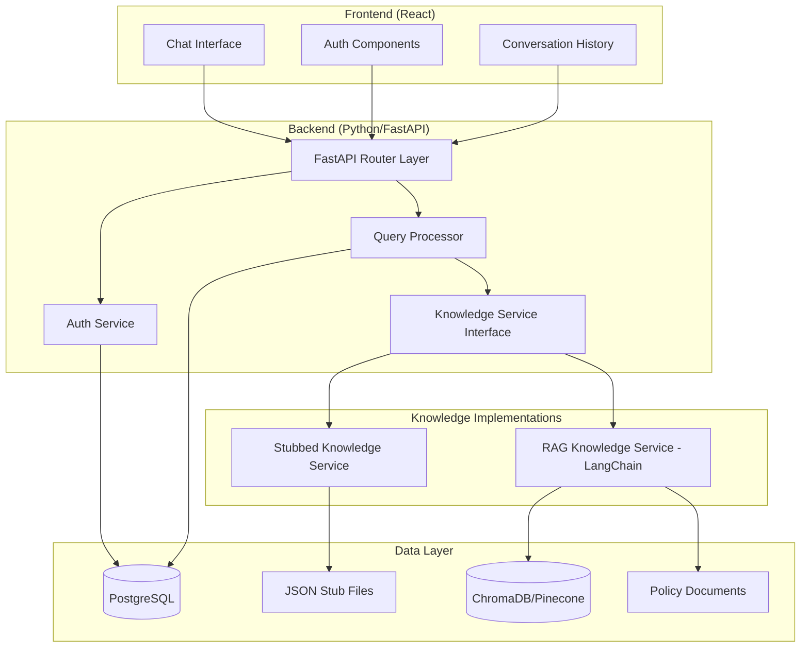
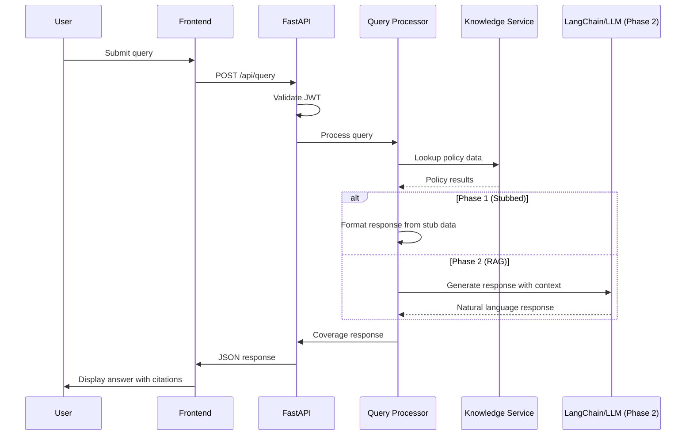

# Design Document: Medical Billing Copilot

## Overview

The Medical Billing Copilot is a web-based conversational AI assistant that helps SMB medical billing staff get instant answers to billing policy questions. The system is designed with a two-phase architecture:

- **Phase 1 (MVP)**: Full-featured web application with stubbed policy data, enabling UX validation and early user feedback
- **Phase 2**: RAG-backed knowledge system with live policy data ingestion

The key architectural decision is the **Knowledge Service abstraction** - a unified interface that allows the application to work identically whether backed by stubbed JSON data or a full RAG pipeline. This enables rapid MVP development while preserving a clear upgrade path.

### Technology Stack

- **Frontend**: React with TypeScript, TailwindCSS for styling
- **Backend**: Python with FastAPI
- **RAG Framework**: LangChain (Phase 2)
- **Vector Database**: ChromaDB for development, Pinecone for production (Phase 2)
- **Database**: PostgreSQL for user data and query logs
- **Authentication**: JWT-based with refresh tokens
- **Web Scraping**: BeautifulSoup for static content, Playwright for dynamic content (Phase 2)
- **LLM**: OpenAI GPT-4 or Anthropic Claude (Phase 2)

## Architecture



### Request Flow



## Components and Interfaces

### Frontend Components (React/TypeScript)

#### ChatInterface
Primary conversational UI component.

```typescript
interface ChatInterfaceProps {
  sessionId: string;
  onNewSession: () => void;
}

interface Message {
  id: string;
  role: 'user' | 'assistant';
  content: string;
  citations?: Citation[];
  timestamp: Date;
}

interface Citation {
  sourceType: 'LCD' | 'NCD' | 'COMMERCIAL' | 'CARC';
  documentId: string;
  documentTitle: string;
  sourceUrl?: string;
  effectiveDate?: Date;
}
```

#### QueryInput
Text input with query submission handling.

```typescript
interface QueryInputProps {
  onSubmit: (query: string) => Promise<void>;
  isLoading: boolean;
  placeholder?: string;
}
```

#### ResponseDisplay
Renders assistant responses with citations and formatting.

```typescript
interface ResponseDisplayProps {
  message: Message;
  onCitationClick?: (citation: Citation) => void;
}
```

### Backend Services (Python/FastAPI)

#### AuthService
Handles user authentication and session management.

```python
from pydantic import BaseModel
from datetime import datetime
from typing import Optional
from enum import Enum

class UserRole(str, Enum):
    USER = "user"
    ADMIN = "admin"

class UserProfile(BaseModel):
    id: str
    email: str
    organization_id: Optional[str] = None
    role: UserRole

class AuthResult(BaseModel):
    access_token: str
    refresh_token: str
    expires_in: int
    user: UserProfile

class TokenPayload(BaseModel):
    user_id: str
    email: str
    role: UserRole
    exp: datetime

class AuthService:
    async def login(self, email: str, password: str) -> AuthResult: ...
    async def logout(self, user_id: str) -> None: ...
    async def refresh_token(self, refresh_token: str) -> AuthResult: ...
    async def validate_token(self, token: str) -> TokenPayload: ...
    async def lock_account(self, user_id: str) -> None: ...
```

#### QueryProcessor
Orchestrates query handling and response generation.

```python
from pydantic import BaseModel
from typing import Optional, List
from enum import Enum
from datetime import datetime

class QueryType(str, Enum):
    COVERAGE_LOOKUP = "COVERAGE_LOOKUP"
    LCD_QUERY = "LCD_QUERY"
    DENIAL_EXPLANATION = "DENIAL_EXPLANATION"
    PRIOR_AUTH = "PRIOR_AUTH"
    GENERAL = "GENERAL"

class DataSource(str, Enum):
    STUBBED = "STUBBED"
    RAG = "RAG"

class Citation(BaseModel):
    source_type: str  # LCD, NCD, COMMERCIAL, CARC
    document_id: str
    document_title: str
    source_url: Optional[str] = None
    effective_date: Optional[datetime] = None

class Message(BaseModel):
    id: str
    role: str  # user, assistant
    content: str
    citations: Optional[List[Citation]] = None
    timestamp: datetime

class QueryRequest(BaseModel):
    session_id: str
    user_id: str
    query: str
    context: Optional[dict] = None

class QueryResponse(BaseModel):
    message: Message
    query_type: QueryType
    confidence: float
    data_source: DataSource

class QueryProcessor:
    async def process_query(self, request: QueryRequest) -> QueryResponse: ...
    async def get_conversation_history(self, session_id: str) -> List[Message]: ...
    async def create_session(self, user_id: str) -> str: ...
```

#### KnowledgeService (Abstract Interface)
Abstraction layer for policy data access - the key to phased development.

```python
from abc import ABC, abstractmethod
from pydantic import BaseModel
from typing import Optional, List
from datetime import datetime
from enum import Enum

class ConditionType(str, Enum):
    DIAGNOSIS = "DIAGNOSIS"
    FREQUENCY = "FREQUENCY"
    DOCUMENTATION = "DOCUMENTATION"
    OTHER = "OTHER"

class DenialCategory(str, Enum):
    ELIGIBILITY = "ELIGIBILITY"
    AUTHORIZATION = "AUTHORIZATION"
    CODING = "CODING"
    DOCUMENTATION = "DOCUMENTATION"
    OTHER = "OTHER"

class CoverageCondition(BaseModel):
    type: ConditionType
    description: str
    required_icd_codes: Optional[List[str]] = None
    frequency_limit: Optional[str] = None

class AlternativeCode(BaseModel):
    cpt_code: str
    description: str
    reason: str

class CoverageResult(BaseModel):
    cpt_code: str
    cpt_description: str
    is_covered: bool
    payer: str
    conditions: List[CoverageCondition]
    restrictions: List[str]
    alternative_codes: Optional[List[AlternativeCode]] = None
    sources: List[Citation]
    confidence: float

class LCDRevision(BaseModel):
    version: str
    effective_date: datetime
    summary: str

class LCDResult(BaseModel):
    lcd_id: str
    title: str
    mac_region: str
    mac_name: str
    effective_date: datetime
    revision_history: List[LCDRevision]
    covered_cpt_codes: List[str]
    covered_icd_codes: List[str]
    limitations: List[str]
    documentation_requirements: List[str]
    source_url: str

class RecommendedAction(BaseModel):
    priority: int
    action: str
    details: Optional[str] = None

class DenialExplanation(BaseModel):
    carc_code: str
    category: DenialCategory
    short_description: str
    detailed_explanation: str
    common_causes: List[str]
    recommended_actions: List[RecommendedAction]
    related_codes: Optional[List[str]] = None

class PlanVariation(BaseModel):
    plan_type: str
    is_required: bool
    notes: Optional[str] = None

class PriorAuthResult(BaseModel):
    cpt_code: str
    payer: str
    is_required: bool
    plan_variations: Optional[List[PlanVariation]] = None
    submission_requirements: Optional[List[str]] = None
    typical_turnaround: Optional[str] = None
    urgent_exceptions: Optional[List[str]] = None
    contact_info: Optional[str] = None
    sources: List[Citation]

class DataSourceInfo(BaseModel):
    type: DataSource
    last_updated: datetime
    coverage: List[str]

# Lookup parameter models
class CoverageLookupParams(BaseModel):
    cpt_code: str
    icd_codes: Optional[List[str]] = None
    payer: Optional[str] = None
    mac_region: Optional[str] = None

class LCDQueryParams(BaseModel):
    lcd_id: Optional[str] = None
    cpt_code: Optional[str] = None
    mac_region: str

class PriorAuthParams(BaseModel):
    cpt_code: str
    payer: str
    plan_type: Optional[str] = None

class DenialContext(BaseModel):
    payer: Optional[str] = None
    cpt_code: Optional[str] = None
    claim_type: Optional[str] = None

# Abstract Knowledge Service Interface
class KnowledgeService(ABC):
    @abstractmethod
    async def lookup_coverage(self, params: CoverageLookupParams) -> CoverageResult: ...
    
    @abstractmethod
    async def query_lcd(self, params: LCDQueryParams) -> LCDResult: ...
    
    @abstractmethod
    async def explain_denial_code(self, code: str, context: Optional[DenialContext] = None) -> DenialExplanation: ...
    
    @abstractmethod
    async def lookup_prior_auth(self, params: PriorAuthParams) -> PriorAuthResult: ...
    
    @abstractmethod
    def get_data_source_info(self) -> DataSourceInfo: ...
```

#### StubbedKnowledgeService (Phase 1 Implementation)
Implements KnowledgeService using static JSON files.

```python
import json
from pathlib import Path
from typing import Dict, Optional

class StubbedKnowledgeService(KnowledgeService):
    def __init__(self, data_path: str):
        self.data_path = Path(data_path)
        self.coverage_data: Dict[str, dict] = {}
        self.lcd_data: Dict[str, dict] = {}
        self.carc_data: Dict[str, dict] = {}
        self.prior_auth_data: Dict[str, dict] = {}
        self._load_data()
    
    def _load_data(self) -> None:
        # Load JSON stub files
        ...
    
    async def lookup_coverage(self, params: CoverageLookupParams) -> CoverageResult: ...
    async def query_lcd(self, params: LCDQueryParams) -> LCDResult: ...
    async def explain_denial_code(self, code: str, context: Optional[DenialContext] = None) -> DenialExplanation: ...
    async def lookup_prior_auth(self, params: PriorAuthParams) -> PriorAuthResult: ...
    def get_data_source_info(self) -> DataSourceInfo: ...
```

#### RAGKnowledgeService (Phase 2 Implementation)
Implements KnowledgeService using LangChain with vector search and LLM.

```python
from langchain.vectorstores import Chroma, Pinecone
from langchain.embeddings import OpenAIEmbeddings
from langchain.chat_models import ChatOpenAI
from langchain.chains import RetrievalQA

class RAGConfig(BaseModel):
    vector_store_type: str  # "chroma" or "pinecone"
    embedding_model: str
    llm_model: str
    collection_name: str
    pinecone_api_key: Optional[str] = None
    pinecone_environment: Optional[str] = None

class RAGKnowledgeService(KnowledgeService):
    def __init__(self, config: RAGConfig):
        self.config = config
        self.embeddings = OpenAIEmbeddings(model=config.embedding_model)
        self.llm = ChatOpenAI(model=config.llm_model)
        self.vector_store = self._init_vector_store()
        self.qa_chain = self._init_qa_chain()
    
    def _init_vector_store(self):
        if self.config.vector_store_type == "chroma":
            return Chroma(
                collection_name=self.config.collection_name,
                embedding_function=self.embeddings
            )
        elif self.config.vector_store_type == "pinecone":
            return Pinecone.from_existing_index(
                index_name=self.config.collection_name,
                embedding=self.embeddings
            )
    
    def _init_qa_chain(self):
        return RetrievalQA.from_chain_type(
            llm=self.llm,
            chain_type="stuff",
            retriever=self.vector_store.as_retriever()
        )
    
    async def lookup_coverage(self, params: CoverageLookupParams) -> CoverageResult: ...
    async def query_lcd(self, params: LCDQueryParams) -> LCDResult: ...
    async def explain_denial_code(self, code: str, context: Optional[DenialContext] = None) -> DenialExplanation: ...
    async def lookup_prior_auth(self, params: PriorAuthParams) -> PriorAuthResult: ...
    def get_data_source_info(self) -> DataSourceInfo: ...
```

### API Endpoints (FastAPI)

```python
from fastapi import APIRouter, Depends, HTTPException, status
from fastapi.security import HTTPBearer

router = APIRouter()
security = HTTPBearer()

# Authentication
@router.post("/api/auth/login")
async def login(credentials: LoginRequest) -> AuthResult: ...

@router.post("/api/auth/logout")
async def logout(token: str = Depends(security)) -> dict: ...

@router.post("/api/auth/refresh")
async def refresh_token(request: RefreshRequest) -> AuthResult: ...

# Query Processing
@router.post("/api/query")
async def submit_query(request: QueryRequest, token: str = Depends(security)) -> QueryResponse: ...

@router.get("/api/sessions")
async def list_sessions(token: str = Depends(security)) -> List[Session]: ...

@router.get("/api/sessions/{session_id}")
async def get_session(session_id: str, token: str = Depends(security)) -> SessionWithMessages: ...

@router.post("/api/sessions")
async def create_session(token: str = Depends(security)) -> Session: ...

@router.delete("/api/sessions/{session_id}")
async def delete_session(session_id: str, token: str = Depends(security)) -> dict: ...

# Direct Lookups (optional structured access)
@router.get("/api/coverage")
async def lookup_coverage(params: CoverageLookupParams = Depends(), token: str = Depends(security)) -> CoverageResult: ...

@router.get("/api/lcd")
async def query_lcd(params: LCDQueryParams = Depends(), token: str = Depends(security)) -> LCDResult: ...

@router.get("/api/denial-codes/{code}")
async def explain_denial_code(code: str, context: DenialContext = Depends(), token: str = Depends(security)) -> DenialExplanation: ...

@router.get("/api/prior-auth")
async def lookup_prior_auth(params: PriorAuthParams = Depends(), token: str = Depends(security)) -> PriorAuthResult: ...
```

## Data Models

### Database Models (SQLAlchemy)

```python
from sqlalchemy import Column, String, DateTime, Integer, Enum, ForeignKey, Text
from sqlalchemy.orm import relationship
from sqlalchemy.ext.declarative import declarative_base
from datetime import datetime
import enum

Base = declarative_base()

class UserRole(enum.Enum):
    USER = "user"
    ADMIN = "admin"

class User(Base):
    __tablename__ = "users"
    
    id = Column(String, primary_key=True)
    email = Column(String, unique=True, nullable=False)
    password_hash = Column(String, nullable=False)
    organization_id = Column(String, nullable=True)
    role = Column(Enum(UserRole), default=UserRole.USER)
    failed_login_attempts = Column(Integer, default=0)
    locked_until = Column(DateTime, nullable=True)
    created_at = Column(DateTime, default=datetime.utcnow)
    updated_at = Column(DateTime, default=datetime.utcnow, onupdate=datetime.utcnow)
    
    sessions = relationship("Session", back_populates="user")

class Session(Base):
    __tablename__ = "sessions"
    
    id = Column(String, primary_key=True)
    user_id = Column(String, ForeignKey("users.id"), nullable=False)
    title = Column(String, nullable=True)
    created_at = Column(DateTime, default=datetime.utcnow)
    updated_at = Column(DateTime, default=datetime.utcnow, onupdate=datetime.utcnow)
    
    user = relationship("User", back_populates="sessions")
    messages = relationship("MessageRecord", back_populates="session")

class MessageRecord(Base):
    __tablename__ = "messages"
    
    id = Column(String, primary_key=True)
    session_id = Column(String, ForeignKey("sessions.id"), nullable=False)
    role = Column(String, nullable=False)  # user, assistant
    content = Column(Text, nullable=False)
    citations_json = Column(Text, nullable=True)  # JSON serialized citations
    created_at = Column(DateTime, default=datetime.utcnow)
    
    session = relationship("Session", back_populates="messages")

class QueryLog(Base):
    __tablename__ = "query_logs"
    
    id = Column(String, primary_key=True)
    session_id = Column(String, ForeignKey("sessions.id"), nullable=False)
    user_id = Column(String, ForeignKey("users.id"), nullable=False)
    query = Column(Text, nullable=False)
    query_type = Column(String, nullable=False)
    response_time_ms = Column(Integer, nullable=False)
    data_source = Column(String, nullable=False)  # STUBBED, RAG
    created_at = Column(DateTime, default=datetime.utcnow)
```

### Stubbed Data Schema (JSON Files)

```python
from pydantic import BaseModel
from typing import List, Optional
from datetime import datetime

class StubbedDataMetadata(BaseModel):
    version: str
    last_updated: str
    description: str

class ICDMapping(BaseModel):
    icd_code: str
    is_covered: bool
    conditions: List[str]

class CoverageRecord(BaseModel):
    cpt_code: str
    description: str
    payer: str
    icd_mappings: List[ICDMapping]

class CARCRecord(BaseModel):
    code: str
    category: str
    short_description: str
    detailed_explanation: str
    common_causes: List[str]
    recommended_actions: List[str]

class MACRegionRecord(BaseModel):
    mac_id: str
    mac_name: str
    states: List[str]
    jurisdictions: List[str]

class LCDRecord(BaseModel):
    lcd_id: str
    title: str
    mac_region: str
    mac_name: str
    effective_date: str
    covered_cpt_codes: List[str]
    covered_icd_codes: List[str]
    limitations: List[str]
    documentation_requirements: List[str]
    source_url: str

class NCDRecord(BaseModel):
    ncd_id: str
    title: str
    effective_date: str
    covered_cpt_codes: List[str]
    covered_icd_codes: List[str]
    limitations: List[str]
    source_url: str

class PriorAuthRecord(BaseModel):
    cpt_code: str
    payer: str
    is_required: bool
    plan_variations: Optional[List[dict]] = None
    submission_requirements: Optional[List[str]] = None
    typical_turnaround: Optional[str] = None

class PayerRecord(BaseModel):
    payer_id: str
    name: str
    type: str  # commercial, medicare, medicaid

class StubbedDataSet(BaseModel):
    metadata: StubbedDataMetadata
    coverage: List[CoverageRecord]
    lcds: List[LCDRecord]
    ncds: List[NCDRecord]
    carc_codes: List[CARCRecord]
    prior_auth: List[PriorAuthRecord]
    payers: List[PayerRecord]
    mac_regions: List[MACRegionRecord]
```


## Correctness Properties

*A property is a characteristic or behavior that should hold true across all valid executions of a system—essentially, a formal statement about what the system should do. Properties serve as the bridge between human-readable specifications and machine-verifiable correctness guarantees.*

Based on the acceptance criteria analysis, the following properties must hold for the Medical Billing Copilot:

### Property 1: Response Time Compliance
*For any* valid query submitted to the Copilot, the response SHALL be returned within 3 seconds.
**Validates: Requirements 1.1**

### Property 2: Source Citation Completeness
*For any* Coverage_Response returned by the Copilot, the response SHALL contain at least one Citation with valid sourceType, documentId, and documentTitle fields.
**Validates: Requirements 1.3, 3.5**

### Property 3: Session Context Preservation
*For any* session with prior queries, a follow-up query referencing previous context SHALL receive a response that incorporates that context.
**Validates: Requirements 1.4**

### Property 4: Not-Found Response Handling
*For any* query referencing a CPT code, ICD code, or payer not in the database, the Copilot SHALL return a response indicating the item was not found and include suggested alternatives or next steps.
**Validates: Requirements 1.5, 5.4**

### Property 5: Coverage Lookup Completeness
*For any* valid CPT_Code and ICD_Code combination in the database, the CoverageResult SHALL include: isCovered status, payer, all applicable conditions, and source citations.
**Validates: Requirements 2.1, 2.2**

### Property 6: Payer Filtering Correctness
*For any* coverage query with a specified payer, the response SHALL only include coverage information for that payer. *For any* coverage query without a specified payer, the response SHALL default to Medicare and indicate this assumption.
**Validates: Requirements 2.3, 2.4**

### Property 7: Non-Covered Code Handling
*For any* CPT_Code that is not covered for a specified ICD_Code, the response SHALL include an explanation and suggest alternative covered codes when available.
**Validates: Requirements 2.5**

### Property 8: LCD Query Completeness
*For any* valid LCD query by MAC region, the LCDResult SHALL include: lcdId, title, effectiveDate, revisionHistory (if any), and sourceUrl.
**Validates: Requirements 3.1, 3.2, 3.3**

### Property 9: MAC Region Requirement
*For any* LCD query without a specified MAC region, the Copilot SHALL either prompt for region selection or return NCD (national) coverage information.
**Validates: Requirements 3.4**

### Property 10: CARC Explanation Completeness
*For any* valid CARC_Code, the DenialExplanation SHALL include: category, shortDescription, detailedExplanation, commonCauses (if any), and recommendedActions.
**Validates: Requirements 4.1, 4.2, 4.3, 4.5**

### Property 11: Prior Auth Response Completeness
*For any* prior authorization query where auth is required, the PriorAuthResult SHALL include: isRequired=true, submissionRequirements, typicalTurnaround, and planVariations (if applicable).
**Validates: Requirements 5.1, 5.2, 5.3, 5.5**

### Property 12: Knowledge Service Interchangeability
*For any* query, both StubbedKnowledgeService and RAGKnowledgeService SHALL return responses conforming to the same interface types (CoverageResult, LCDResult, DenialExplanation, PriorAuthResult).
**Validates: Requirements 6.3**

### Property 13: Data Source Metadata Inclusion
*For any* response from the Knowledge_Service, the response SHALL include DataSourceInfo indicating the source type ('STUBBED' or 'RAG') and lastUpdated timestamp.
**Validates: Requirements 6.4**

### Property 14: Authentication Enforcement
*For any* request to a protected API endpoint without a valid JWT token, the API SHALL return a 401 Unauthorized response.
**Validates: Requirements 7.1**

### Property 15: Session Timeout Enforcement
*For any* session inactive for more than 30 minutes, subsequent requests with that session's token SHALL require re-authentication.
**Validates: Requirements 7.3**

### Property 16: Account Lockout Enforcement
*For any* user account with 3 consecutive failed login attempts, subsequent login attempts SHALL be rejected until the lockout period expires.
**Validates: Requirements 7.5**

### Property 17: Query Audit Logging
*For any* query processed by the Copilot, a QueryLog entry SHALL be created with userId, sessionId, query text, queryType, and timestamp.
**Validates: Requirements 7.4**

### Property 18: Session History Isolation
*For any* user creating a new session, the new session SHALL not affect the history of previous sessions, and previous session history SHALL remain retrievable.
**Validates: Requirements 8.4, 8.5**

## Error Handling

### API Error Responses

All API errors follow a consistent format:

```typescript
interface APIError {
  code: string;
  message: string;
  details?: Record<string, unknown>;
  timestamp: string;
  requestId: string;
}
```

### Error Categories

| Error Code | HTTP Status | Description |
|------------|-------------|-------------|
| AUTH_INVALID_CREDENTIALS | 401 | Invalid email or password |
| AUTH_TOKEN_EXPIRED | 401 | JWT token has expired |
| AUTH_ACCOUNT_LOCKED | 403 | Account temporarily locked |
| AUTH_INSUFFICIENT_PERMISSIONS | 403 | User lacks required permissions |
| QUERY_INVALID_FORMAT | 400 | Query is malformed or empty |
| QUERY_CPT_NOT_FOUND | 404 | CPT code not in database |
| QUERY_PAYER_NOT_SUPPORTED | 404 | Payer not in database |
| QUERY_MAC_REGION_INVALID | 400 | Invalid MAC region specified |
| QUERY_CARC_NOT_FOUND | 404 | CARC code not recognized |
| KNOWLEDGE_SERVICE_ERROR | 500 | Internal knowledge service failure |
| RATE_LIMIT_EXCEEDED | 429 | Too many requests |

### Graceful Degradation

1. **Knowledge Service Fallback**: If RAG service is unavailable, system can fall back to stubbed data with clear indication to user
2. **Partial Results**: If some data sources fail, return available data with indication of incomplete results
3. **Timeout Handling**: Long-running queries return partial results with option to continue

### Validation Rules

```python
import re
from pydantic import validator, BaseModel
from typing import ClassVar

class ValidationPatterns:
    CPT_CODE: ClassVar[re.Pattern] = re.compile(r"^[0-9]{5}$")
    ICD_CODE: ClassVar[re.Pattern] = re.compile(r"^[A-Z][0-9]{2}(\.[0-9]{1,4})?$")
    CARC_CODE: ClassVar[re.Pattern] = re.compile(r"^[0-9]{1,3}$")
    MAC_REGION: ClassVar[re.Pattern] = re.compile(r"^(MAC[A-Z]|[0-9]{1,2})$")
    EMAIL: ClassVar[re.Pattern] = re.compile(r"^[^\s@]+@[^\s@]+\.[^\s@]+$")

class PasswordPolicy:
    MIN_LENGTH: int = 8
    REQUIRE_UPPERCASE: bool = True
    REQUIRE_NUMBER: bool = True
    
    @classmethod
    def validate(cls, password: str) -> bool:
        if len(password) < cls.MIN_LENGTH:
            return False
        if cls.REQUIRE_UPPERCASE and not any(c.isupper() for c in password):
            return False
        if cls.REQUIRE_NUMBER and not any(c.isdigit() for c in password):
            return False
        return True

def validate_cpt_code(code: str) -> bool:
    return bool(ValidationPatterns.CPT_CODE.match(code))

def validate_icd_code(code: str) -> bool:
    return bool(ValidationPatterns.ICD_CODE.match(code))

def validate_carc_code(code: str) -> bool:
    return bool(ValidationPatterns.CARC_CODE.match(code))
```

## Testing Strategy

### Dual Testing Approach

The Medical Billing Copilot uses both unit tests and property-based tests for comprehensive coverage:

- **Unit tests**: Verify specific examples, edge cases, and error conditions
- **Property tests**: Verify universal properties across all valid inputs using randomized testing

### Property-Based Testing Configuration

- **Library**: Hypothesis (Python property-based testing library)
- **Minimum iterations**: 100 per property test
- **Tag format**: `Feature: medical-billing-copilot, Property {number}: {property_text}`

### Test Categories

#### Unit Tests (pytest)
- Authentication flow (login, logout, token refresh)
- Input validation (CPT codes, ICD codes, CARC codes)
- Error handling for invalid inputs
- Edge cases (empty queries, special characters)
- API endpoint response formats

#### Property-Based Tests (Hypothesis)
Each correctness property from the design document will have a corresponding property-based test:

```python
from hypothesis import given, strategies as st, settings
import pytest

# Example generators for property-based tests
cpt_code = st.from_regex(r"^[0-9]{5}$", fullmatch=True)
icd_code = st.from_regex(r"^[A-Z][0-9]{2}\.[0-9]{1,2}$", fullmatch=True)
carc_code = st.integers(min_value=1, max_value=999).map(str)
payer = st.sampled_from(["Medicare", "Aetna", "UnitedHealthcare", "Cigna", "Humana"])
mac_region = st.sampled_from(["MACA", "MACB", "MACC", "1", "2", "3"])

@st.composite
def coverage_query(draw):
    return {
        "cpt_code": draw(cpt_code),
        "icd_codes": draw(st.lists(icd_code, min_size=0, max_size=5)),
        "payer": draw(st.one_of(st.none(), payer)),
    }
```

1. **Response Time Property Test**
   ```python
   @given(query=coverage_query())
   @settings(max_examples=100)
   def test_response_time_under_3_seconds(query):
       """Feature: medical-billing-copilot, Property 1: Response time under 3 seconds"""
       # Generate random valid queries
       # Verify all complete within 3 seconds
   ```

2. **Citation Completeness Property Test**
   ```python
   @given(query=coverage_query())
   @settings(max_examples=100)
   def test_all_responses_include_citations(query):
       """Feature: medical-billing-copilot, Property 2: All responses include valid source citations"""
       # Generate random coverage queries
       # Verify all responses contain valid citations
   ```

3. **Coverage Lookup Property Test**
   ```python
   @given(cpt=cpt_code, icd=icd_code)
   @settings(max_examples=100)
   def test_coverage_lookups_return_complete_info(cpt, icd):
       """Feature: medical-billing-copilot, Property 5: Coverage lookups return complete information"""
       # Generate random CPT/ICD combinations from valid set
       # Verify response structure completeness
   ```

4. **Payer Filtering Property Test**
   ```python
   @given(query=coverage_query())
   @settings(max_examples=100)
   def test_payer_filtering_works_correctly(query):
       """Feature: medical-billing-copilot, Property 6: Payer filtering works correctly"""
       # Generate queries with and without payer specified
       # Verify correct filtering behavior
   ```

5. **CARC Explanation Property Test**
   ```python
   @given(code=carc_code)
   @settings(max_examples=100)
   def test_carc_explanations_contain_required_fields(code):
       """Feature: medical-billing-copilot, Property 10: CARC explanations contain all required fields"""
       # Generate random valid CARC codes
       # Verify all required fields present
   ```

6. **Knowledge Service Interchangeability Test**
   ```python
   @given(query=coverage_query())
   @settings(max_examples=100)
   def test_knowledge_service_implementations_interchangeable(query):
       """Feature: medical-billing-copilot, Property 12: Knowledge service implementations are interchangeable"""
       # Generate random queries
       # Run against both stubbed and RAG implementations
       # Verify response types match
   ```

7. **Authentication Enforcement Property Test**
   ```python
   @given(endpoint=st.sampled_from(["/api/query", "/api/sessions", "/api/coverage"]))
   @settings(max_examples=100)
   def test_authentication_required_for_protected_endpoints(endpoint):
       """Feature: medical-billing-copilot, Property 14: Authentication is required for all protected endpoints"""
       # Generate random protected endpoint requests
       # Verify 401 response without valid token
   ```

8. **Account Lockout Property Test**
   ```python
   @given(attempts=st.integers(min_value=3, max_value=10))
   @settings(max_examples=100)
   def test_failed_login_attempts_trigger_lockout(attempts):
       """Feature: medical-billing-copilot, Property 16: Failed login attempts trigger account lockout"""
       # Generate sequences of failed login attempts
       # Verify lockout triggers after 3 failures
   ```

9. **Audit Logging Property Test**
   ```python
   @given(query=coverage_query())
   @settings(max_examples=100)
   def test_query_audit_logging_captures_all_queries(query):
       """Feature: medical-billing-copilot, Property 17: Query audit logging captures all queries"""
       # Generate random queries
       # Verify QueryLog entry created for each
   ```

10. **Session Isolation Property Test**
    ```python
    @given(num_sessions=st.integers(min_value=2, max_value=5))
    @settings(max_examples=100)
    def test_session_history_properly_maintained(num_sessions):
        """Feature: medical-billing-copilot, Property 18: Session history is properly maintained"""
        # Generate sequences of session operations
        # Verify session history isolation
    ```

### Integration Tests
- End-to-end query flow from UI to knowledge service
- Session management across multiple requests
- Authentication token lifecycle
- Knowledge service implementation swapping

### Test Directory Structure

```
tests/
├── unit/
│   ├── test_auth_service.py
│   ├── test_query_processor.py
│   ├── test_knowledge_service.py
│   ├── test_validators.py
│   └── test_api_endpoints.py
├── property/
│   ├── test_response_properties.py
│   ├── test_coverage_properties.py
│   ├── test_auth_properties.py
│   └── test_session_properties.py
├── integration/
│   ├── test_query_flow.py
│   ├── test_session_management.py
│   └── test_knowledge_service_swap.py
└── conftest.py  # Shared fixtures and generators
```
